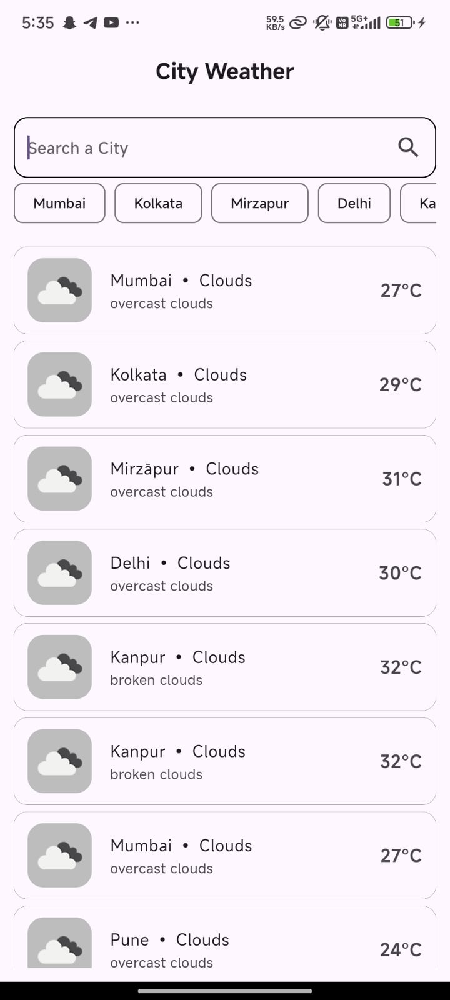

# 🌦️ Test Weather App

A simple Flutter app to using **OpenWeather API**.  
You can search for any city, view default cities' weather, and access recent searches.

## 📱 Screenshot

| Home Screen                                  |
| -------------------------------------------- |
|  |

## 🚀 Features

- Search weather by city
- Default cities shown on app start
- Recent search history (saved locally)

## 📦 Dependencies

- [http](https://pub.dev/packages/http)
- [shared_preferences](https://pub.dev/packages/shared_preferences)

## ▶️ Run Locally

```bash
# Clone the repository
git clone https://github.com/your-username/testweatherapp.git
cd testweatherapp

# Install dependencies
flutter pub get

# Run the app
flutter run
```

---

Made by Aditya Vishwakarma
